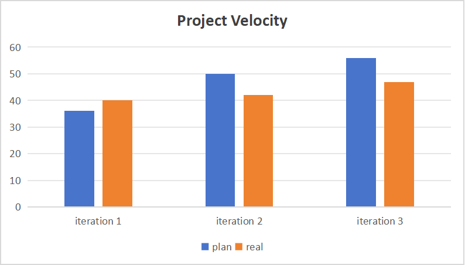

****

***1.Parts doesn't meet expectations***

------

**Technical：**

In the early planning of the project, it was hoped to create a complete employee schedule management system, which included an automatic scheduling algorithm, which automatically arranged the working time for the employee based on the available time. However, in the specific implementation process, there were several problems involved, and the team members had inconsistent views on this design, which led to ambiguity when members developed functions separately. Our project had inconsistent problems when merging, and we spent a lot of time revising it. Finally, we deleted the scheduling algorithm and replaced it with manual work arrangement by the manager.

 **Communication：**

One of our members did not participate in the project at the beginning because he had to deal with personal matters, and he dropped out of the course in the second iteration. This prevented the design we had started from going as planned, so we rearranged the assignments and tweaked the design to ensure delivery.

------

**2.Methods for improving these problems**

------
#### a. Task Reassignment and Increased Communication

1. **Task Reassignment**:
   - **Redistribution**: We reassigned tasks to better match each team member’s strengths and current workload. This helped balance responsibilities and ensure everyone was working on manageable tasks.
2. **Increased Communication**:
   - **More Frequent Meetings**: We held more frequent meetings to track progress and address issues quickly. This helped keep everyone updated and allowed for timely problem-solving.
   - **Immediate Problem Reporting**: We encouraged team members to report issues as soon as they arose, which helped us adapt our plans more flexibly.
3. **Flexible Planning**:
   - **Adjustable Plans**: We adjusted our project plan as needed to address new challenges. This flexibility allowed us to adapt to changes and keep the project on track.

#### b. Adjustments to Design and Function Realization

1. **Design Changes**:
   - **Simplified Design**: We revised the original design to make it more practical given the constraints. This included simplifying some features to ensure core functionalities were implemented.
2. **Ensuring Functionality**:
   - **Prioritized Features**: We focused on delivering the most important functions first, ensuring that the system met essential requirements.
   - **Testing**: We conducted thorough testing to verify that the revised functions worked correctly.
3. **Iterative Refinement**:
   - **Continuous Improvement**: We made ongoing improvements based on feedback and testing results to refine the system and ensure it met project goals.

------

**3.project velocity:**

------
Below is a chart of project speed statistics:

------

**4.Conclusion***

------

Throughout the project, the team gained valuable experience and acquired several new skills:

1. **Technical Skills**:
   - **Android Development**: The team improved their proficiency in Android development, gaining hands-on experience with various aspects of building and optimizing mobile applications.
   - **Integration and System Testing**: We learned effective techniques for integration and system testing, which are crucial for ensuring that different components of the system work together seamlessly and meet overall quality standards.
   - **HSQLDB**: The team became adept at using HSQLDB, enhancing our ability to manage and interact with databases effectively within the project.
2. **Teamwork and Flexibility**:
   - **Adaptability**: The project emphasized the importance of flexibility in project management. We learned to adapt our plans and approaches in response to changing circumstances, such as personnel changes and technical challenges.
   - **Task Reassignment**: We developed strategies for quickly reassigning tasks and redistributing responsibilities to address gaps caused by team member absences or changes. This helped us maintain project momentum and ensure timely delivery.
   - **Problem-Solving**: The experience underscored the need for effective problem-solving skills. When faced with obstacles, we learned to promptly adjust our strategies and implement solutions to overcome technical and logistical issues.
3. **Overall Impact**:
   - **Enhanced Collaboration**: The project strengthened our ability to work collaboratively and communicate effectively as a team. We learned to support each other and coordinate efforts to achieve common goals.
   - **Resilience and Efficiency**: We improved our resilience in handling unexpected challenges and became more efficient in managing project tasks. The lessons learned from this project will be valuable for future projects, enabling us to approach similar situations with greater confidence and competence.

In conclusion, the project provided a rich learning experience, equipping the team with practical skills and insights that will benefit us in future endeavors. The ability to adapt, learn, and work effectively as a team was crucial to the successful delivery of the project.

